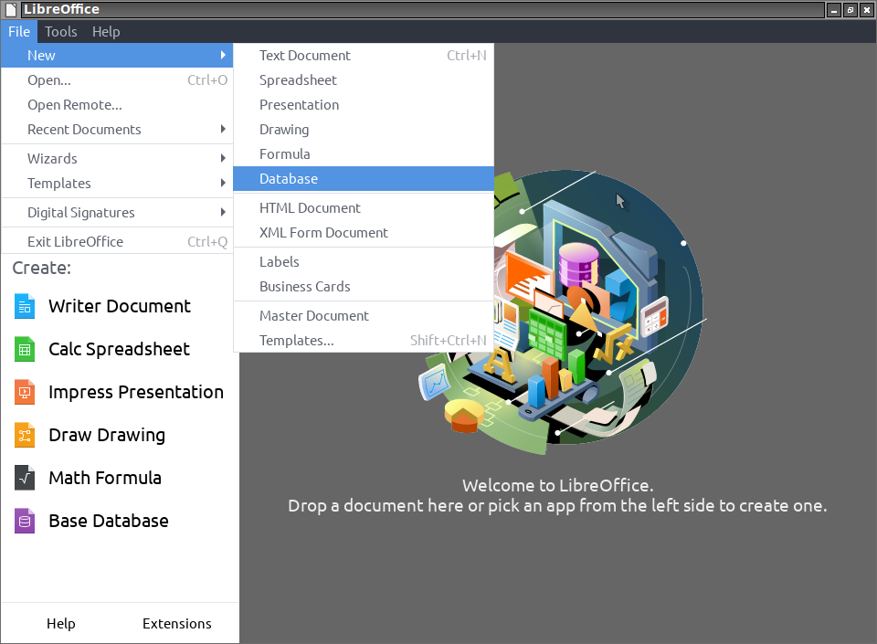
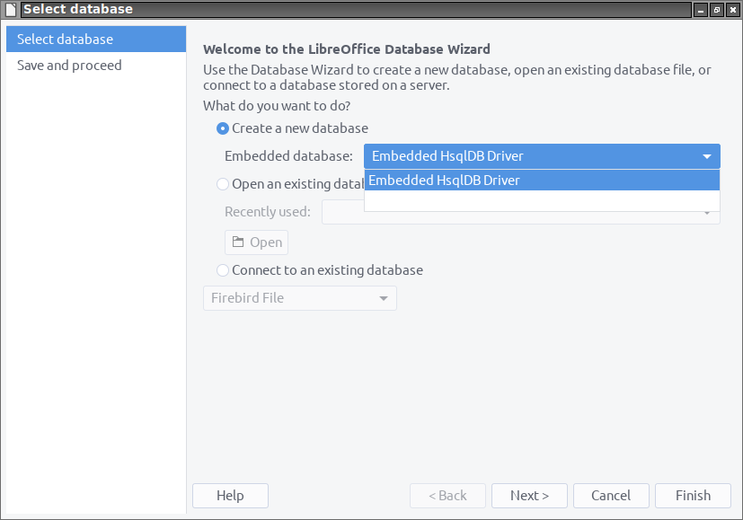

**This [document](https://prrvchr.github.io/HsqlDBembeddedOOo) in English.**

**L'utilisation de ce logiciel vous soumet à nos** [**Conditions d'utilisation**](https://prrvchr.github.io/HsqlDBembeddedOOo/HsqlDBembeddedOOo/registration/TermsOfUse_fr)

# version [0.0.3](https://prrvchr.github.io/HsqlDBembeddedOOo/README_fr#historique)

## Introduction:

**HsqlDBembeddedOOo** fait partie d'une [Suite](https://prrvchr.github.io/README_fr) d'extensions [LibreOffice](https://fr.libreoffice.org/download/telecharger-libreoffice/) et/ou [OpenOffice](https://www.openoffice.org/fr/Telecharger/) permettant de vous offrir des services inovants dans ces suites bureautique.  

Cette extension vous permet:
- De surmonter le [dysfonctionnement 139538](https://bugs.documentfoundation.org/show_bug.cgi?id=139538) pour les utilisateurs de **LibreOffice sur Linux**.
- D'utiliser HsqlDB intégré en mode non compressé (fractionné), qui est plus robuste, avec la version du pilote HsqlDB de votre choix.
- De migrer les données d'une base de données intégrée (fichier odb) vers le pilote HsqlDB complet: [HsqlDBDriverOOo](https://prrvchr.github.io/HsqlDBDriverOOo/README_fr), voir: [Comment migrer une base de données intégrée](https://prrvchr.github.io/HsqlDBembeddedOOo/README_fr#comment-migrer-une-base-de-donn%C3%A9es-int%C3%A9gr%C3%A9e).

Si ces possibilités ne vous concernent pas, alors je vous recommande d'utiliser le driver [HsqlDBDriverOOo](https://prrvchr.github.io/HsqlDBDriverOOo/README_fr) permettant d'exploiter toutes les fonctionnalités offertes par HsqlDB.

Etant un logiciel libre je vous encourage:
- A dupliquer son [code source](https://github.com/prrvchr/HsqlDBembeddedOOo/).
- A apporter des modifications, des corrections, des améliorations.
- D'ouvrir un [dysfonctionnement](https://github.com/prrvchr/HsqlDBembeddedOOo/issues/new) si nécessaire.

Bref, à participer au developpement de cette extension.  
Car c'est ensemble que nous pouvons rendre le Logiciel Libre plus intelligent.

## Prérequis:

[HsqlDB](http://hsqldb.org/) est une base de données écrite en Java.  
L'utilisation de HsqlDB nécessite l'installation et la configuration dans LibreOffice / OpenOffice d'un **JRE version 1.8 minimum** (c'est-à-dire: Java version 8)  
Je vous recommande [AdoptOpenJDK](https://adoptopenjdk.net/) comme source d'installation de Java.

Si vous utilisez **LibreOffice sous Linux**, alors vous êtes sujet au [dysfonctionnement 139538](https://bugs.documentfoundation.org/show_bug.cgi?id=139538).  
Pour contourner le problème, veuillez désinstaller les paquets:
- libreoffice-sdbc-hsqldb
- libhsqldb1.8.0-java

OpenOffice et LibreOffice sous Windows ne sont pas soumis à ce dysfonctionnement.

## Installation:

Il semble important que le fichier n'ait pas été renommé lors de son téléchargement.  
Si nécessaire, renommez-le avant de l'installer.

- Installer l'extension [HsqlDBembeddedOOo.oxt](https://github.com/prrvchr/HsqlDBembeddedOOo/releases/download/v0.0.3/HsqlDBembeddedOOo.oxt) version 0.0.3.

Redémarrez LibreOffice / OpenOffice après l'installation.

## Utilisation:

### Comment créer une nouvelle base de données:

Dans LibreOffice / OpenOffice aller à: Fichier -> Nouveau -> Base de données...:

A l'étape: Sélectionner une base de données:
- selectionner: Créer une nouvelle base de données
- Dans: Base de données intégrée: choisir: Pilote HsqlDB intégré
- cliquer sur le bouton: Suivant

A l'étape: Enregistrer et continuer:
- ajuster les paramètres selon vos besoins...
- cliquer sur le bouton: Terminer

Maintenant à vous d'en profiter...

### Comment migrer une base de données intégrée:

Si vous souhaitez migrer une base de données intégrée (HsqlDB version 1.8.0) vers la dernière version (par exemple 2.5.1), procédez comme suit:
- 1 - Faite une copie (sauvegarde) de votre base de donnée (fichier odb).
- 2 - Aprés avoir installer cette extension, ouvrir ce fichier odb dans Base (double cliquez sur l'odb).
- 3 - Dans Base allez à: Outils -> SQL et tapez la commande SQL: `SHUTDOWN COMPACT` ou `SHUTDOWN SCRIPT`
- 4 - Changez la version du pilote HsqlDB dans:  Outils -> Options -> Pilotes Base -> Pilote HsqlDB intégré par une version 2.4.x ou 2.5.0
- 5 - Redémarrer LibreOffice / OpenOffice aprés le changement du driver (hsqldb.jar).
- Recommencez cette procedure à l'étape 2 en utilisant la version 2.5.1.

Maintenant vous pouvez utiliser la version complète du pilote [HsqlDBDriverOOo](https://prrvchr.github.io/HsqlDBDriverOOo/README_fr), votre base de données est dans un dossier avec le même nom et emplacement que votre fichier odb.

## A été testé avec:

* OpenOffice 4.1.8 - Ubuntu 20.04 - LxQt 0.14.1

* OpenOffice 4.1.8 - Windows 7 SP1

* LibreOffice 7.0.4.2 - Ubuntu 20.04 - LxQt 0.14.1

* LibreOffice 6.4.4.2 - Windows 7 SP1

Je vous encourage en cas de problème :-(  
de créer un [dysfonctionnement](https://github.com/prrvchr/HsqlDBembeddedOOo/issues/new)  
J'essaierai de le résoudre ;-)

## Historique:

### Ce qui a été fait pour la version 0.0.1:

- La rédaction de ce pilote a été facilitée par une [discussion avec Villeroy](https://forum.openoffice.org/en/forum/viewtopic.php?f=13&t=103912), sur le forum OpenOffice, que je tiens à remercier, car la connaissance ne vaut que si elle est partagée...

- Utilisation de l'ancienne version de HsqlDB 1.8.0 (peut être facilement mise à jour).

- Ajout d'une boîte de dialogue permettant de mettre à jour le pilote (hsqldb.jar) dans: Outils -> Options -> Pilotes Base -> Pilote HsqlDB intégré

- Beaucoup d'autres correctifs...

### Ce qui a été fait pour la version 0.0.2:

- Maintenant, le pilote divise automatiquement un odb lorsqu'il est ouvert... Cela rend le pilote rétrocompatible avec le pilote LibreOffice Embedded HsqlDB intégré ;-)

- Beaucoup d'autres correctifs...

### Ce qui a été fait pour la version 0.0.3:

- Je tiens particulièrement à remercier fredt à [hsqldb.org](http://hsqldb.org/) pour:

    - Son accueil pour ce projet et sa permission d'utiliser le logo HsqlDB dans l'extension.

    - La qualité de sa base de données HsqlDB.

- Fonctionne désormais avec OpenOffice sous Windows.

- Lors de la décompression, un conflit de nom de fichier affiche désormais une erreur précise.

- Gère désormais correctement les espaces dans les noms de fichiers et les chemins.

- Beaucoup d'autres correctifs...

### Que reste-t-il à faire pour la version 0.0.3:

- Ajouter de nouvelles langue pour l'internationalisation...

- Tout ce qui est bienvenu...
